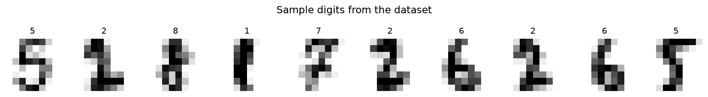
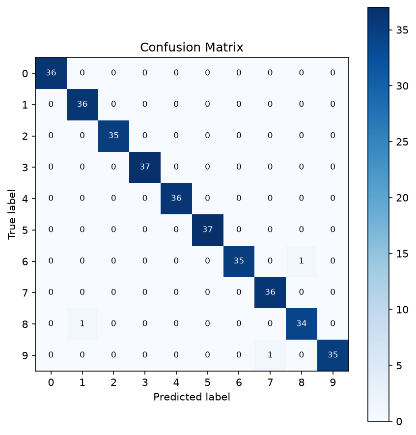
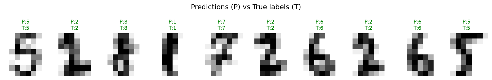

# Handwritten Digit Recognition

A simple, self-contained machine learning project that recognizes handwritten
digits (0–9). Built to demonstrate the **fundamentals of AI/ML**: loading
data, splitting it into train/test sets, training models, evaluating them,
visualizing results, and saving a trained model for reuse.

Two classic models are trained and compared:

- **SVM (Support Vector Machine)** — a strong traditional ML baseline
- **MLP (Multi-Layer Perceptron)** — a small neural network

The better-performing model is automatically saved and can be reused for
predictions.

## Dataset

Uses scikit-learn's built-in [`load_digits`](https://scikit-learn.org/stable/datasets/toy_dataset.html#optical-recognition-of-handwritten-digits-dataset)
dataset — **1,797 images**, each an 8x8 grayscale grid of a handwritten digit
(0–9). It ships with scikit-learn, so **no external download is required**;
the project runs immediately after installing dependencies.

## Project Structure

```
handwritten-digit-recognition/
├── src/
│   ├── utils.py     # data loading + plotting helpers
│   ├── train.py     # trains SVM & MLP, evaluates, saves best model
│   └── predict.py   # loads saved model and predicts on test samples
├── images/          # generated plots (created by train.py)
├── models/          # saved trained model (created by train.py)
├── requirements.txt
└── README.md
```

## Setup

```bash
git clone https://github.com/<your-username>/handwritten-digit-recognition.git
cd handwritten-digit-recognition
pip install -r requirements.txt
```

## Usage

**1. Train the models**

```bash
python src/train.py
```

This will:
- Load and split the dataset (80% train / 20% test)
- Train an SVM and an MLP classifier
- Print accuracy and a full classification report for each
- Save visualizations to `images/`
- Save the best-performing model to `models/digit_classifier.joblib`

**2. Run predictions with the saved model**

```bash
python src/predict.py
```

Loads the saved model and predicts 10 sample digits from the test set,
printing whether each prediction was correct.

## Results

On a held-out test set of 360 images:

| Model | Test Accuracy | Training Time |
|-------|---------------|---------------|
| **SVM (RBF kernel)** | **99.17%** | ~0.03s |
| MLP (Neural Network) | 96.67% | ~0.55s |

The SVM was selected as the best model and saved.

### Sample digits from the dataset


### Confusion matrix (SVM)
Nearly perfect diagonal — only 2 misclassifications out of 360 test images.



### Sample predictions
Green = correct prediction, red = incorrect. `P` = predicted, `T` = true label.



## What this project demonstrates

- Loading and splitting a dataset (train/test split, stratified sampling)
- Training a classical ML model (SVM) vs. a simple neural network (MLP)
- Evaluating models with accuracy, precision, recall, F1-score, and a
  confusion matrix
- Visualizing raw data and model predictions
- Saving/loading a trained model with `joblib`
- A clean, reproducible project structure suitable for a GitHub repo

## Possible extensions

- Swap in the full MNIST dataset (28x28, 70,000 images) for a bigger challenge
- Add a CNN using PyTorch or TensorFlow for higher accuracy
- Build a small web UI (e.g. Streamlit) to draw a digit and get a live prediction
- Add cross-validation and hyperparameter tuning (`GridSearchCV`)

## License

MIT — see [LICENSE](LICENSE).
